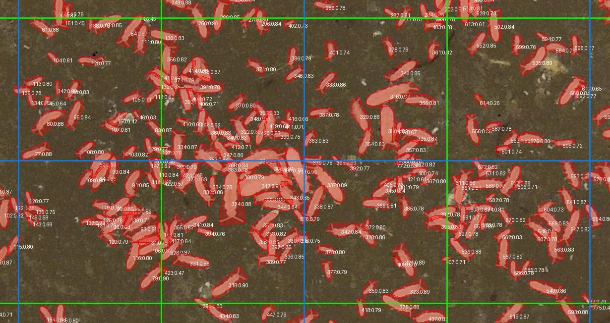

# COLLEMBOT — Collembola Counting Toolkit (v0.1.0)

COLLEMBOT is a reproducible pipeline for counting *Collembola* organisms in ecotoxicity soil slide images. It includes YOLOv11-seg inference, training utilities for curated datasets, and comparative benchmarking for segmentation backbones. Release: **v0.1.0**.

<p align="center">
  <br>
  <em>Example detections of COLLEMBOT v0.1.0</em>
</p>


## Repository layout
- `configs/`
  - `inference.yaml` — inference configuration.
  - `train.yaml` — single-run training configuration.
  - `train_multirun.yaml` — multi-run training & model comparison configuration.
- `scripts/`
  - `run_inference.py` — tiling, YOLO inference, fusion, visualization, and metrics.
  - `train_model.py` — dataset preparation + YOLO training and evaluation.
  - `compare_models.py` — multi-model benchmarking (YOLO, Mask R-CNN, Mask2Former, MaskDINO).
  - `detectron_batching.py` — VRAM-aware batch sizing for Detectron2.
  - `upscale_images.py` — optional slide upscaling helper.
  - `gradio_app.py` — Colab-ready Gradio helper.
- `data/` — CC-BY-4.0 datasets and examples (see `data/README.md`).
- `notebooks/` — Colab walkthroughs and launchers.

## Installation
1. Install [Anaconda](https://www.anaconda.com/products/individual) or [Miniconda](https://docs.conda.io/en/latest/miniconda.html).
2. Create and activate an environment:
   ```bash
   conda create -n collembola python=3.10
   conda activate collembola
   ```
3. Install dependencies:
   ```bash
   pip install -r requirements.txt
   ```
4. Verify the GPU is visible to PyTorch:
   ```bash
   python - <<'PY'
   import torch
   print('CUDA available:', torch.cuda.is_available())
   PY
   ```

## Data organization
Inference images live in the folder referenced by `images_folder` in `configs/inference.yaml`. A typical layout is:
```
project_root/
├── configs/
│   └── inference.yaml
├── data/
│   ├── inference-examples/
│   ├── train-labelme-amsterdam/
│   ├── train-labelme-basel/
│   ├── train-labelme-bayreuth/
│   ├── train-labelme-cai_pyramids/
│   └── train-labelme-coimbra/
```
Tiles are automatically created at 576×576 pixels with an optional 288-pixel shift for overlap.

## Inference configuration (`configs/inference.yaml`)
Key parameters for `scripts/run_inference.py`:
```yaml
images_folder: data/inference-examples
experiments_dir: exps
model:
  folder: model
  archive: best.pt.7z
  weights: best.pt
  fuse: false
```
Adjust paths and parallelism to match local resources. The script extracts missing `.pt` weights from the archive automatically and records the originating image directory for reproducibility.
Model weights permalink: https://zenodo.org/records/17987887/files/collembot_yolo11xseg_v_0_1_0.pt?download=1

## Running inference
```bash
python scripts/run_inference.py
```
Key behaviors:
1. **Experiment folders** — Each run creates `exps/exp_XXXX_<timestamp>/` (or uses `EXP_DIR` if set) with subfolders for tiles, results, visualizations, logs, and stats.
2. **Tiling & filtering** — Slides are split into `ori` and `shift` grids of 576×576 tiles. Bright or blueish tiles are skipped to reduce false positives; skip reasons are recorded alongside tile metadata.
3. **YOLO inference** — Multi-GPU, multi-processing inference loads one model per GPU, supports optional layer fusion, and can export tile-level LabelMe JSONs (`labelme/`) with confidences preserved in the `flags` section.
4. **Polygon assembly** — Tile detections are offset back to slide coordinates, cached in `raw_polygons.pkl`, and enriched with tile bounding boxes and skip reasons to speed up re-runs.
5. **Fusion & statistics** — Graph-cut fusion merges overlapping polygons using the configured confidence/IoU/angle priors. The pipeline writes per-slide counts, precision, recall, F1, and R² against CSV annotations to `stats/pipeline_results.csv` and a JSON summary. Annotated overlays are saved to `final_viz/`, `final_viz_ori/`, and `final_viz_shift/`.

## Training pipeline (`scripts/train_model.py`)
`scripts/train_model.py` builds a YOLO dataset from one or more labeled sources and launches Ultralytics training:
- **Config-driven**: accepts a YAML file (default `configs/train.yaml`) describing datasets, class names, image sizing, and hyperparameters.
- **Dataset handling**: images/labels can live in separate directories per dataset; filenames are sanitised and deduplicated. Optional `tst_reserve.json` files reserve specific images for testing.
- **Splitting**: train/val/test splits are generated per dataset using the configured ratios, with logs detailing sample counts and any size mismatches between images and labels.
- **Training**: runs the Ultralytics CLI with the assembled `data.yaml`, respecting multi-GPU `device` entries and mixed-precision/augmentation settings. Checkpoints and metrics are stored under `train_experiments/<timestamp>/`.
- **Evaluation**: after training, the script re-runs evaluation and summarises metrics alongside the split manifest for reproducibility.

Run training with:
```bash
python scripts/train_model.py --config configs/train.yaml
```
To re-evaluate an existing experiment without retraining:
```bash
python scripts/train_model.py --evalonly path/to/train_experiments/exp_xxxx
```

### Multi-run training
`configs/train_multirun.yaml` defines lists of models, seeds, or datasets to sweep. Pass it to `scripts/compare_models.py` to launch multiple training runs and gather comparative metrics across checkpoints.

## End-to-end workflow overview
Use the toolkit in the following order for most projects:
1. **(Optional) Upscale slide imagery** with `scripts/upscale_images.py` if the slides are too low-resolution for robust segmentation.
2. **Prepare training data** with LabelMe-style annotations, then run `scripts/train_model.py` to build YOLO datasets and train the segmentation model.
3. **Benchmark models** across YOLO/Detectron2 backbones with `scripts/compare_models.py` if you need a comparative study.
4. **Run inference** on new slides using `scripts/run_inference.py`.
5. **(Optional) Serve an interactive demo** in Colab with `scripts/gradio_app.py`.

The sections below document each script in detail, including inputs, outputs, and parameters.

## Script reference (detailed usage)

### `scripts/run_inference.py` — full inference pipeline
**Purpose:** End-to-end inference (tiling → YOLO inference → polygon fusion → metrics + visualizations).  
**Invocation:**
```bash
python scripts/run_inference.py
```
**Configuration:** This script currently **always reads** `configs/inference.yaml`. If you need a different config file, edit `configs/inference.yaml` or change `CONFIG_PATH` inside the script.  

**Key inputs (from `configs/inference.yaml`):**
- `images_folder`: Folder with slide images to process.
- `experiments_dir`: Root for experiment outputs (e.g., `exps/`).
- `model.folder`, `model.weights`: Folder and weights filename.
- `model.archive`: Optional `7z` archive containing weights (auto-extracted if weights are missing).
- `model.fuse`: Fuse model layers for faster inference.
- `tile.size` / `tile.shift`: Tile size and overlap shift.
- `parallel.n_gpus`, `parallel.n_jobs`, `parallel.batch_size`: GPU and CPU parallelism.
- `fusion.best_conf`, `fusion.best_iou`, `fusion.alpha`: Graph-cut fusion parameters.
- `skip_bright`, `skip_blue`: Filters for tiles likely to be empty or overexposed.

**Environment overrides:**
- `EXP_DIR`: If set, outputs are written into this directory instead of a new `exps/exp_XXXX_...` folder.

**Outputs (under `exps/exp_XXXX_<timestamp>/`):**
- `tiles/` + `results/`: Raw tiling and per-tile YOLO outputs.
- `labelme/`: Optional tile-level LabelMe JSONs.
- `final_viz/`, `final_viz_ori/`, `final_viz_shift/`: Visual overlays.
- `stats/pipeline_results.csv`: Per-slide counts and metrics.
- `stats/summary.json`: Aggregated precision/recall/F1 (if annotations present).
- `logs/pipeline.log`: Run logs.

**Notes:**
- The script writes `source_folder.txt` and `tiles_source.txt` to capture which image folders were used.
- If `model.archive` is defined and the `model.weights` file is missing, it is automatically extracted.

---

### `scripts/train_model.py` — training pipeline
**Purpose:** Build a YOLO dataset from one or more annotated sources and launch Ultralytics training.  
**Invocation:**
```bash
python scripts/train_model.py --config configs/train.yaml
```
**Optional evaluation-only mode:**
```bash
python scripts/train_model.py --evalonly path/to/train_experiments/exp_train_YYYYMMDD-HHMMSS
```

**Key inputs (from `configs/train.yaml`):**
- `datasets`: List of `{name, images, labels}` entries (LabelMe JSONs per image).
- `splits`: Train/val/test ratios.
- `image.target_size`: Target tile size for YOLO.
- `model.checkpoint`: Base YOLO checkpoint (e.g., `yolo11x-seg.pt`).
- `model.device` / `training.device`: GPU device list.
- `training.*`: Ultralytics training hyperparameters.

**Outputs (under `train_experiments/exp_train_YYYYMMDD-HHMMSS/`):**
- `dataset/`: Prepared YOLO dataset (images/labels per split + `data.yaml` + `manifest.csv`).
- `training/`: Ultralytics training outputs (checkpoints, tensorboard logs, metrics).
- `stats/`: Post-training evaluation summaries.
- `logs/train.log`: Training logs.

**Notes:**
- If a dataset contains `tst_reserve.json`, those images are reserved for testing.
- The script sanitizes and deduplicates filenames across datasets to avoid collisions.

---

### `scripts/compare_models.py` — multi-model benchmarking
**Purpose:** Train/evaluate YOLOv11, Mask R-CNN, Mask2Former, and MaskDINO using the same prepared dataset.  
**Invocation:**
```bash
python scripts/compare_models.py --config configs/train_multirun.yaml
```
**Optional overrides:**
```bash
python scripts/compare_models.py --config configs/train_multirun.yaml --experiment-root train_experiments_custom
```

**Key inputs (from `configs/train_multirun.yaml`):**
- `models.*`: Enable/disable each backbone via `active: true/false`.
- `models.*.config_file` and `models.*.weights_url`: Detectron2/Mask2Former/MaskDINO configs and pretrained weights.
- `optimizer`, `lr_scheduler`, `solver`: Shared training settings.
- `model_overrides`: Per-backbone Detectron2 config overrides.

**Outputs (under `train_experiments/exp_train_YYYYMMDD-HHMMSS/`):**
- `dataset/`: Copied YOLO dataset + COCO conversions for Detectron2.
- `comparison/`: Per-model metrics and summary tables.
- `visualizations/`: Sample overlays per dataset and model.
- `logs/train.log`: Comparison run logs.

**Dependencies & setup notes:**
- Requires Detectron2 and any local checkouts of Mask2Former/MaskDINO referenced in the config.
- If `config_file` points inside a local repository, the script attempts to add the repo to `sys.path` automatically.
- Batch sizes for Detectron2 models are sized using available GPU VRAM (see `scripts/detectron_batching.py`).

---

### `scripts/detectron_batching.py` — VRAM-aware batching helper
**Purpose:** Utility functions to compute a safe Detectron2 batch size based on available GPU memory.  
**Usage (import in Python):**
```python
from scripts.detectron_batching import collect_gpu_vram, compute_vram_aware_batch_size

memories = collect_gpu_vram()
batch = compute_vram_aware_batch_size(memories, fallback_batch=4)
print("Batch size:", batch)
```
This module is intended to be imported (not executed directly). It is used by `scripts/compare_models.py`.

---

### `scripts/upscale_images.py` — Real-ESRGAN 2× upscaling
**Purpose:** Upscale JPG slide images using Real-ESRGAN x2 across multiple GPUs.  
**Invocation:**
```bash
python scripts/upscale_images.py --input_dir data/inference-examples --output_dir data/inference-examples-upscaled
```

**Key arguments:**
- `--input_dir`: Directory with `.jpg`/`.jpeg` images (recursive by default).
- `--output_dir`: Output directory with mirrored structure.
- `--weights`: Path to `RealESRGAN_x2plus.pth` (auto-download if omitted).
- `--gpus`: Comma-separated GPU ids (default: all visible).
- `--tile`: Tile size (use 512/1024 if you hit CUDA OOM).
- `--tile_pad`, `--pre_pad`: Tiling settings to avoid seams.
- `--fp16`: Enable FP16 inference (recommended on some GPUs).
- `--jpg_quality`: Output JPEG quality (0–100).
- `--overwrite`: Overwrite existing outputs.
- `--no_recursive`: Disable recursive input scanning.
- `--warmup`: Run a short warmup pass on each GPU.

**Outputs:** Upscaled images written to `output_dir` with the same relative paths as the input images.

**License note:** This script uses **Real-ESRGAN** components from https://github.com/xinntao/Real-ESRGAN/, which are licensed under **BSD-3-Clause**. The upstream weights are downloaded from the Real-ESRGAN releases page.

---

### `scripts/gradio_app.py` — Colab/Gradio demo helper
**Purpose:** Launch a lightweight Gradio UI for interactive inference in Colab or notebooks.  
**Usage (in Python/Colab):**
```python
from scripts.gradio_app import launch_app

launch_app(
    model_path="model/best.pt",
    fuse=False,
    example_image="data/inference-examples/sample.jpg",
)
```

**Key parameters:**
- `model_path`: Path to YOLO weights (`.pt`).
- `fuse`: Whether to fuse model layers.
- `preferred_device`: `"auto"`, `"cpu"`, or a CUDA device id string (e.g., `"0"`).
- `predict_batch_size`: Tile batch size.
- `use_half`: Force FP16/FP32 inference.

**Outputs:** The app returns an annotated image plus a JSON summary (fused counts + detection polygons).

## Model weights
The published model weights are **AGPL-3.0 only** and can be obtained from Zenodo:
https://doi.org/10.5281/zenodo.17987886

Direct Link to the weights file:
https://zenodo.org/records/17987887/files/collembot_yolo11xseg_v_0_1_0.pt?download=1

## Dependencies
This project depends on **YOLOv11 by Ultralytics**, which is licensed under **AGPL-3.0**. The dependency is not bundled with this repository.

## Licensing
- **Code**: MIT License (see `LICENSE`).
- **Data**: CC-BY-4.0 (see `data/README.md`).
- **Model weights**: AGPL-3.0 only (see Zenodo DOI above).
- **Real-ESRGAN elements** (used by `scripts/upscale_images.py`): BSD-3-Clause (see https://github.com/xinntao/Real-ESRGAN/).

## Citation (required)
Author attribution is required for academic or derivative use (see `CITATION.md`):

**Wehrli & Meyer & Souza da Silva et al.; 2026; COLLEMBOT: AI-based counting of Collembola for OECD 232 tests (in preparation)**

Authors (* shared first authors): Micha Wehrli*, Adrian Meyer*, Éverton Souza da Silva*, Sam van Loon, Bart G. van Hall, Cornelis A. M. van Gestel, Tiago Natal-da-Luz, Max V. R. Döring, Heike Feldhaar, Magdalena Mair, Denis Jordan, Miriam Langer

Affiliations: Eawag (CH) · FHNW (CH) · University of Zurich (CH) · University of Bayreuth (DE) · Vrije Universiteit Amsterdam (NL) · Cloverstrategy Lda (PT)

## Contact
Adrian Meyer — adrian.meyer@fhnw.ch
